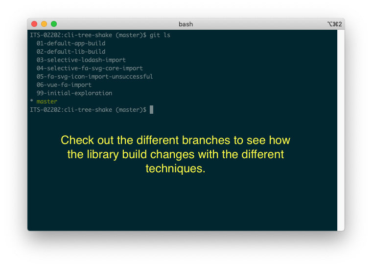
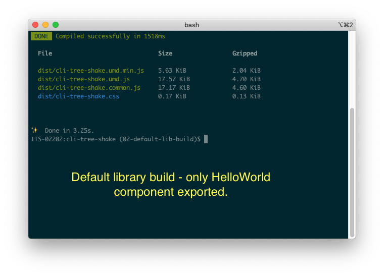
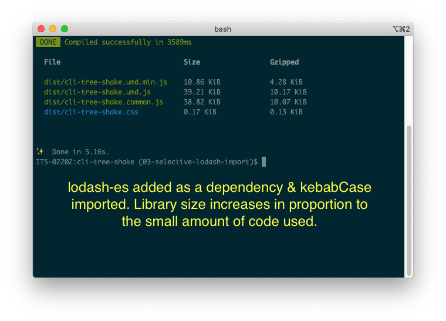
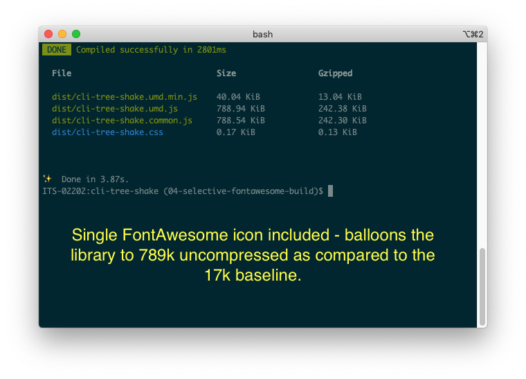
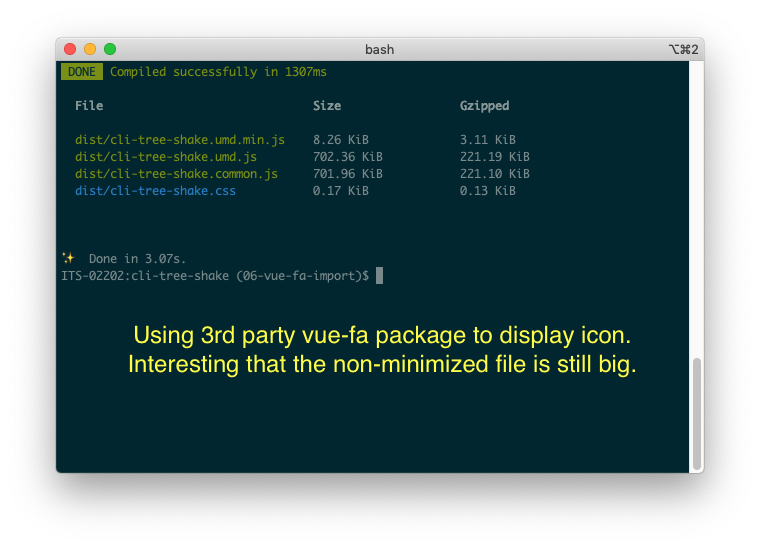

# cli-tree-shake

I built this repo to explore and better understand Vue CLI's default webpack configuration in regards to tree shaking and library minimization. Specifically, we noticed that FontAwesome was adding a lot of weight to our bundled library even though we thought we were following best practices from their site.

This repo contains a list of numbered branches (as seen in the first screenshot below) that establish a baseline for both the application and library builds and then make small changes to illustrate how different packages and imports effect the build size.



## Application baseline
Branch `01-default-app-build` is a Vue CLI app as generated by the `create` script. It contains the basic `HelloWorld` component.


## Library baseline
Branch `02-default-lib-build` adds the `build-lib` script to `package.json` to build the project as a library. The library's entrypoint (`/src/index.js`) exports the `HelloWorld` component.


## Import single function from Lodash
Since we were not seeing tree shaking from our FontAwesome imports, I wanted to see what the behavior would be with other libraries. Lodash is often mentioned as a package that can benefit from selective import. Branch`03-selective-lodash-import` brings the `kebabCase` function into `HelloWorld`. We can see that the resulting build is still a reasonable size.

```javascript
import { kebabCase } from 'lodash-es'
```
 


## FontAwesome single icon, official library import

The branch `04-selective-fa-svg-core-import` demonstrates the technique we were using to import FontAwesome icons into our library. We took this technique from FontAwesome's [vue-fontawesome](https://github.com/FortAwesome/vue-fontawesome#recommended) repository, and we believed this was the best practice. Initially, the 789k number scared me. You can see the minimized version isn't quite so bad but still seems excessive for a single SVG icon.

```vue
<template>
    <p style="font-size: 4em;">
      Check square: <FAIcon icon="check-square" />
    </p>
</template>
```

```vue
<script>
import { library } from '@fortawesome/fontawesome-svg-core'
import { FontAwesomeIcon as FAIcon } from '@fortawesome/vue-fontawesome'
import { faCheckSquare } from '@fortawesome/free-solid-svg-icons'

library.add(faCheckSquare)

export default {
  name: 'HelloWorld',
  props: {
    msg: String
  },
  components: {
    FAIcon
  },
}
</script>
``` 



## FontAwesome single icon, 3rd party vue-fa component
Researching this problem, I eventually stumbled upon this issue in Font-Awesome repository: [Tree-Shaking broken on fontawesome-svg-core](https://github.com/FortAwesome/Font-Awesome/issues/16005). A comment here pointed me to the [vue-fa](https://cweili.github.io/vue-fa/) component. The branch `06-vue-fa-import` illustrates the build sizes when using `vue-fa` to import a single icon. It's interesting to see that the unminimized UMD library is still big, but the minimized version is quite small.

```vue
<template>
    <p style="font-size: 4em;">
      Check square: <fa :icon="faCheckSquare" />
    </p>
</template>
```

```vue
<script>
import Fa from 'vue-fa'
import { faCheckSquare } from '@fortawesome/free-solid-svg-icons'


export default {
  name: 'HelloWorld',
  props: {
    msg: String
  },
  components: {
    Fa
  },
  data() {
    return {
      faCheckSquare
    }
  }
}
</script>
```  



## Building and running the project
```
# Download dependencies
yarn install

# Compiles and hot-reloads for development
yarn serve

# Compiles and minifies for production (as application)
yarn build

# Build as library (where applicable)
yarn build-lib
```
